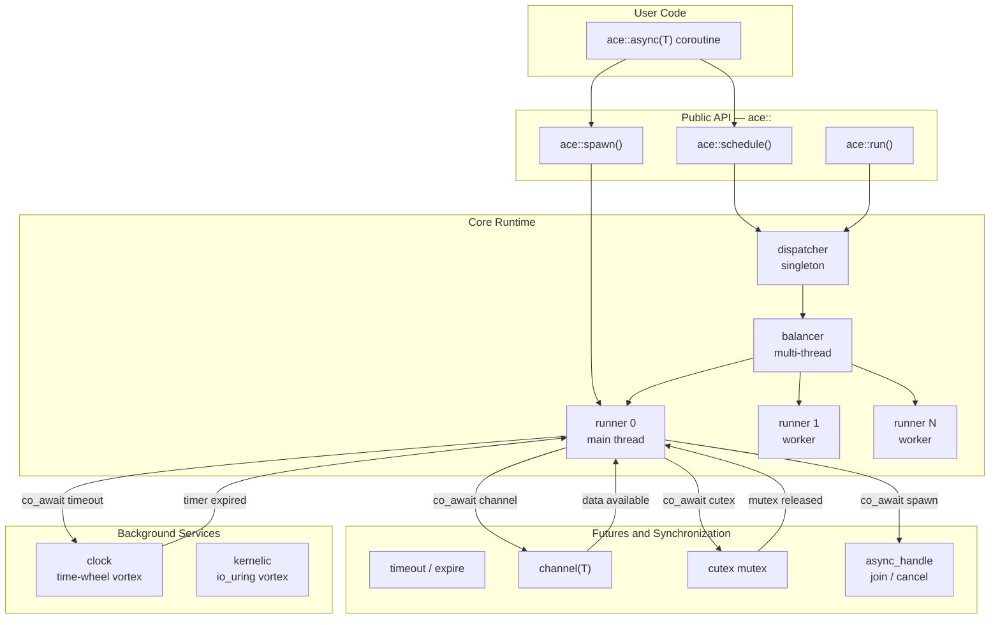
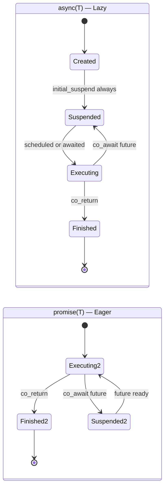
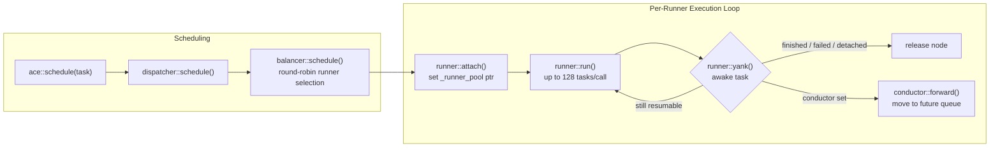
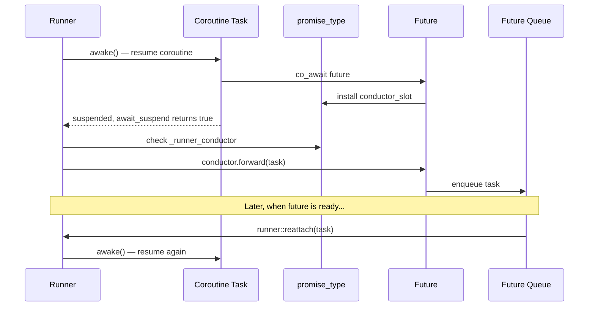
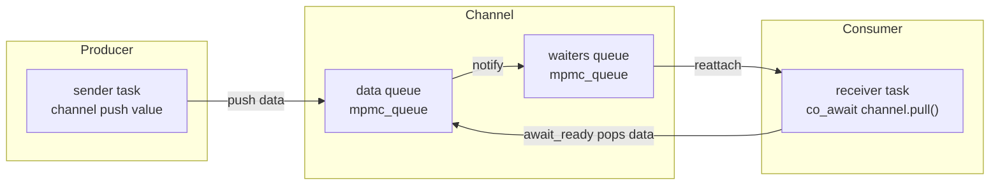
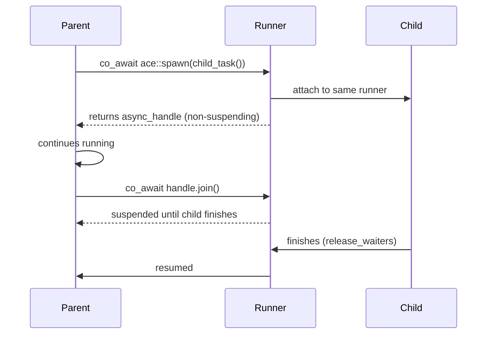
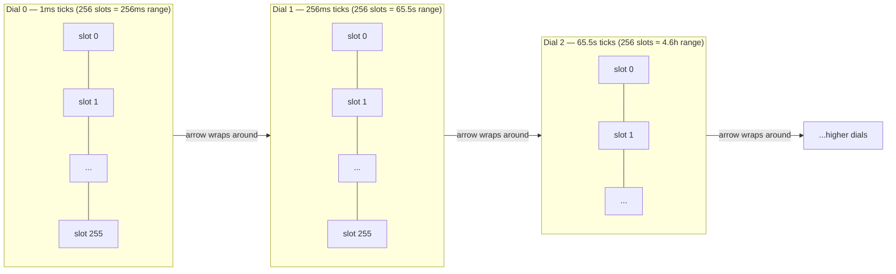
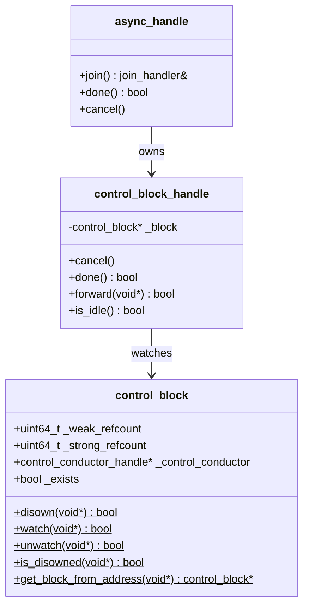

# ACE — Async Concurrent Execution

**ACE** is a header-only C++23 coroutine-based concurrency framework that provides a production-grade async runtime with multi-threaded scheduling, lock-free synchronization primitives, and high-performance I/O integration via `io_uring`.

> **Version:** 0.9.9 &nbsp;|&nbsp; **Language:** C++23

---

## Table of Contents

- [Features](#features)
- [Architecture Overview](#architecture-overview)
- [Core Concepts](#core-concepts)
  - [Coroutine Types](#1-coroutine-types-asynct-and-promiset)
  - [Execution Pipeline](#2-execution-pipeline)
  - [Conductor Pattern](#3-conductor-pattern)
  - [Futures and Synchronization](#4-futures-and-synchronization)
  - [Time Wheel Scheduler](#5-time-wheel-scheduler)
  - [Control Blocks](#6-control-blocks-and-external-handles)
- [Quickstart](#quickstart)
- [Examples](#examples)
- [Configuration](#configuration)
- [Building](#building)
- [API Reference](#api-reference)

---

## Features

| Feature | Details |
|---|---|
| **Header-only** | Zero compilation overhead — just `#include "ace/ace.h"` |
| **Lazy & eager coroutines** | `ace::async<T>` (lazy) and `ace::promise<T>` (eager) |
| **Multi-threaded scheduler** | Work-stealing balancer with configurable runner count |
| **Lock-free channels** | MPMC message passing with static / dynamic allocation |
| **Cooperative mutex (cutex)** | Userspace mutex with zero kernel involvement on fast path |
| **Time-wheel timeouts** | O(1) insert/remove — hierarchical multi-dial wheel |
| **Task cancellation** | External `async_handle` with join / cancel / done |
| **io_uring integration** | Async read / write / network via Linux `io_uring` |

---

## Architecture Overview



---

## Core Concepts

### 1. Coroutine Types: `async<T>` and `promise<T>`

ACE provides two coroutine flavors that differ only in their **initial suspension policy**.



```cpp
// Lazy — suspends immediately, must be explicitly scheduled
ace::async<int> lazy_task() {
    co_return 42;
}

// Eager — starts executing immediately upon creation
ace::promise<int> eager_task() {
    co_return 42;
}
```

**When to use which:**

| Type | Use when |
|---|---|
| `ace::async<T>` | Spawning independent parallel tasks, pipelines |
| `ace::promise<T>` | Short inline operations that must run immediately |

---

### 2. Execution Pipeline



The **balancer** distributes tasks across runners using an atomic counter for round-robin. Each **runner** owns a lock-free MPSC queue. Up to 128 tasks are processed per `run()` call; then the thread sleeps 1 ms if idle.

```cpp
// Configure runner count before first run()
ace::core::s_balancer_config._runners_amount = 4;
ace::reload();          // apply new config (only when queue is empty)

ace::schedule(my_task());
ace::run();             // blocks until all tasks finish
```

---

### 3. Conductor Pattern

The **conductor** is the mechanism that decouples task forwarding from the runner. When a coroutine suspends inside a `co_await future`, the future installs a conductor into the coroutine's promise. The runner then calls `conductor::forward()` instead of re-queuing the task.



**Two conductor types:**

| Type | Purpose |
|---|---|
| `runner_conductor_handle<C>` | Forwards task to a future's waiting queue |
| `control_conductor_handle` | Manages external control (join/cancel) for promises |

---

### 4. Futures and Synchronization

#### Channel — MPMC Message Passing



```cpp
ace::futures::channel<int> chan;

// producer
ace::schedule([&]() -> ace::async<> {
    chan << 42;         // non-blocking push
    co_return;
}());

// consumer
ace::schedule([&]() -> ace::async<> {
    int val = co_await chan.pull();
    // val == 42
    co_return;
}());
```

**Allocation variants:**

```cpp
// Default: fully dynamic (unlimited capacity)
ace::futures::channel<int> dyn_chan;

// Static: bounded buffer and bounded waiters (no heap allocation after init)
ace::futures::channel_static<int, 64, 8> static_chan;

// Dynamic data, static waiters
ace::futures::channel_dyn<int, 4> hybrid_chan;
```

---

#### Cutex — Cooperative Userspace Mutex

The **cutex** is a cooperative mutex with no kernel syscalls on the fast path.

```mermaid
stateDiagram-v2
    direction LR
    [*] --> Unlocked

    Unlocked --> Locked : try_lock()\n(fetch_add == 0)
    Locked --> Unlocked : sync()\n(fetch_sub + notify)
    Locked --> WaiterQueue : try_lock() fails\n(conductor installed)
    WaiterQueue --> Locked : notify()\n(runner::reattach)
```

```cpp
ace::cutex mtx;

ace::async<> critical_section() {
    volatile auto guard = ace::guard(mtx);     // RAII proxy
    auto lock_future = co_await guard->capture();
    // --- critical section ---
    co_await lock_future;
    guard->sync();                             // explicit unlock (also called by ~proxy)
    co_return;
}
```

---

#### Timeout & Expire

```cpp
using namespace std::chrono_literals;

ace::async<> timed_task() {
    co_await ace::futures::timeout(500ms);     // suspend for 500 ms

    // OR: suspend until absolute timepoint
    auto deadline = ace::core::clock::current_time() + 1s;
    co_await ace::futures::expire(deadline);
    co_return;
}
```

---

#### spawn / async_handle — Parallel Tasks



```cpp
ace::async<> parent() {
    auto handle = co_await ace::spawn(child());

    // do other work concurrently...

    bool finished = co_await handle.join();  // wait for child
    // OR: handle.cancel();                  // cancel child
    co_return;
}
```

---

### 5. Time Wheel Scheduler

ACE uses a **hierarchical multi-dial time wheel** for O(1) timer insert and release. Each wheel level has 256 slots; finer wheels cascade into coarser ones.



The clock runs as a **vortex** — a thread-local background coroutine that calls `ping()` each scheduler iteration to release expired tasks back to their runners.

---

### 6. Control Blocks and External Handles

Every coroutine's promise is allocated with a `control_block` prefix (intrusive design — no extra heap allocation).



Memory layout of a coroutine frame:

```
┌────────────────────────────────────┬──────────────────────┬─────────────────────┐
│  control_block  (32 bytes)         │  promise_type        │  coroutine frame    │
│  _weak_refcount                    │  _runner_conductor   │  local variables    │
│  _strong_refcount                  │  _runner_pool        │  ...                │
│  _control_conductor                │  _waiters            │                     │
│  _exists                           │  _status             │                     │
└────────────────────────────────────┴──────────────────────┴─────────────────────┘
 ▲                                    ▲
 get_block_from_address(addr)         address returned by operator new
```

---

## Quickstart

### 1. Add to your project

ACE is header-only. Add the `include/` directory to your include paths and ensure `liburing` is available on Linux.

**With Meson:**

```meson
ace_dep = dependency('ace', fallback: ['ace', 'ace_dep'])
```

**Manual (CMake/plain):**

```cmake
target_include_directories(my_target PRIVATE path/to/ace/include)
target_link_libraries(my_target PRIVATE uring)
```

### 2. Hello, coroutine

```cpp
#include "ace/ace.h"
#include <iostream>

ace::async<> hello() {
    std::cout << "Hello from coroutine!\n";
    co_return;
}

int main() {
    ace::schedule(hello());
    ace::run();
}
```

### 3. Parallel tasks with join

```cpp
#include "ace/ace.h"
#include <iostream>
#include <chrono>

using namespace std::chrono_literals;

ace::async<int> compute(int x) {
    co_await ace::futures::timeout(10ms);   // simulate async work
    co_return x * x;
}

ace::async<> main_task() {
    // spawn two tasks in parallel
    auto h1 = co_await ace::spawn(compute(3));
    auto h2 = co_await ace::spawn(compute(7));

    co_await h1.join();
    co_await h2.join();

    std::cout << "both tasks done\n";
    co_return;
}

int main() {
    ace::schedule(main_task());
    ace::run();
}
```

### 4. Multi-threaded execution

```cpp
int main() {
    // use 4 OS threads
    ace::core::s_balancer_config._runners_amount = 4;
    ace::reload();

    for (int i = 0; i < 100; ++i)
        ace::schedule(my_task(i));

    ace::run();
}
```

---

## Examples

### Producer / Consumer with bounded channel

```cpp
#include "ace/ace.h"

// Static channel: 8 data slots, 4 waiter slots — no heap allocation
ace::futures::channel_static<int, 8, 4> chan;

ace::async<> producer() {
    for (int i = 0; i < 20; ++i) {
        // pending_push waits (via co_await suspend) if channel is full
        co_await chan.pending_push(i);
    }
    co_return;
}

ace::async<> consumer() {
    for (int i = 0; i < 20; ++i) {
        int val = co_await chan.pull();
        (void)val;
    }
    co_return;
}

int main() {
    ace::schedule(producer());
    ace::schedule(consumer());
    ace::run();
}
```

---

### Shared state with cutex

```cpp
#include "ace/ace.h"

ace::cutex mtx;
int shared_counter = 0;

ace::async<> increment(int times) {
    for (int i = 0; i < times; ++i) {
        volatile auto guard = ace::guard(mtx);
        auto future = co_await guard->capture();
        ++shared_counter;
        co_await future;
        guard->sync();
    }
    co_return;
}

int main() {
    ace::core::s_balancer_config._runners_amount = 4;
    ace::reload();

    for (int t = 0; t < 8; ++t)
        ace::schedule(increment(10000));

    ace::run();
    // shared_counter == 80000
}
```

---

### Timeout and cancellation

```cpp
#include "ace/ace.h"
#include <chrono>

using namespace std::chrono_literals;

ace::async<> long_operation() {
    co_await ace::futures::timeout(10s);
    co_return;
}

ace::async<> watchdog() {
    auto handle = co_await ace::spawn(long_operation());
    co_await ace::futures::timeout(500ms);   // wait at most 500ms
    if (!handle.done()) {
        handle.cancel();
    }
    co_return;
}

int main() {
    ace::schedule(watchdog());
    ace::run();
}
```

---

### External task observation

```cpp
ace::async<> work() {
    co_await ace::futures::timeout(std::chrono::milliseconds(100));
    co_return;
}

int main() {
    auto task = work();
    auto handle = task.observe();   // obtain control_block_handle before scheduling

    ace::schedule(std::move(task));

    // check from outside the scheduler:
    // handle.done()   — true if coroutine has finished
    // handle.cancel() — request cancellation

    ace::run();
}
```

---

## Configuration

### Runner count

```cpp
ace::core::s_balancer_config._runners_amount = std::thread::hardware_concurrency();
ace::reload();   // must be called when the queue is empty
```

### Cutex rescheduling mode

When `_rescheduling = true`, the cutex migrates all waiters to the runner that last released it. Useful for CPU-local hot paths.

```cpp
ace::cutex mtx;
mtx.set_rescheduling(true);
```

### Channel allocation policy

```cpp
// Fully dynamic (default) — heap allocates on demand
ace::futures::channel<MyMsg> ch;

// Static — no heap, all sizes fixed at compile time
ace::futures::channel_static<MyMsg, 256, 16> ch;

// Dynamic data queue, static-sized waiter queue
ace::futures::channel_dyn<MyMsg, 4> ch;
```

---

## Building

### Requirements

| Dependency | Version | Notes |
|---|---|---|
| C++ compiler | GCC 13+ / Clang 17+ | C++23 required |
| `liburing` | 2.x | Linux only (for I/O) |
| `nukes` | subproject | Lock-free MPSC/MPMC queues |
| `meson` | 1.0+ | Build system |
| `gtest` | any | Tests only |
| `mimalloc` | 2.x | Tests only |

### Build

```bash
meson setup build
meson compile -C build
```

### Run tests

```bash
meson test -C build --verbose
```

### Generate documentation

```bash
# Requires: doxygen, graphviz (dot)
doxygen Doxyfile
# Open: docs/doxygen/html/index.html
```

---

## API Reference

Full Doxygen-generated API reference is available after running `doxygen Doxyfile`.
Open `docs/doxygen/html/index.html` in a browser.

### Namespace map

| Namespace | Contents |
|---|---|
| `ace` | Public aliases: `async<T>`, `promise<T>`, `cutex`, `guard`; free functions: `schedule()`, `spawn()`, `run()`, `reload()`, `interrupt()`, `terminate()` |
| `ace::coroutines` | Internal coroutine machinery: `context<>`, `promise_traits`, `control_block`, conductors |
| `ace::futures` | Synchronization primitives: `channel`, `cutex_future`, `timeout`, `expire`, `async_handle`, `join_handler` |
| `ace::commands` | Awaitable commands: `spawn`, `reattach`, `roaming`, `get_runner` |
| `ace::core` | Runtime engine: `dispatcher`, `balancer`, `runner`, `clock`, `vortex_traits` |
| `ace::common` | Utilities: `queue`, `slab_mempool`, dispatch concepts |

### Key free functions (`namespace ace`)

```cpp
// Schedule task on the global dispatcher (marks task as roaming)
void schedule(async<>&& task, const core::runner* rnr = nullptr);

// Spawn a parallel task pinned to the current runner (must be co_awaited)
commands::spawn spawn(async<>&& task);

// Returns true when all runners are empty
bool empty();

// Process all scheduled tasks — blocks until the queue is empty
void run();

// Reload balancer configuration (only effective when empty() == true)
void reload();

// Send signals to the running dispatcher
void interrupt();    // pause execution loop
void terminate();    // stop execution loop
void reset_signal(); // clear pending signals
```
