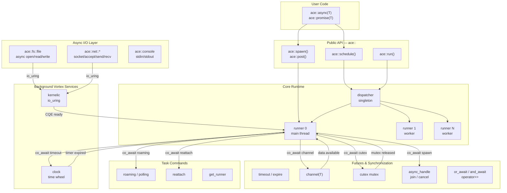
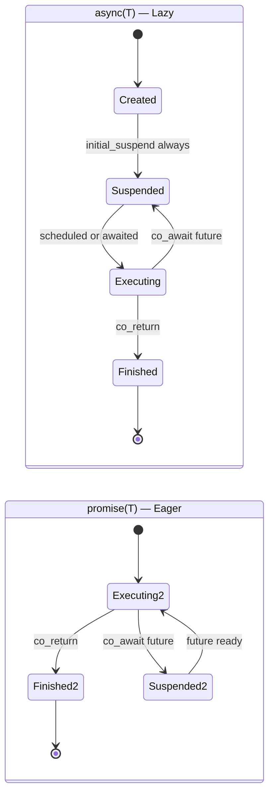
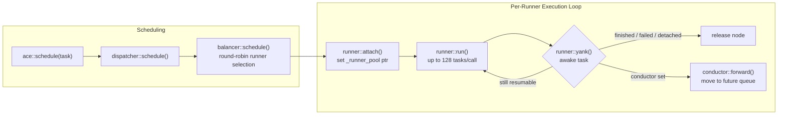
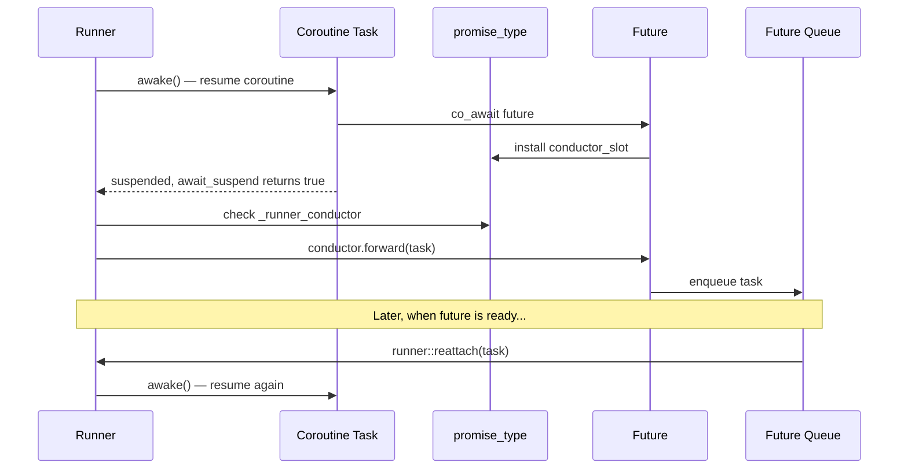
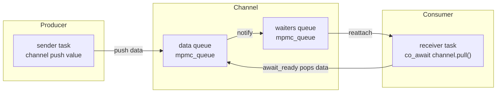
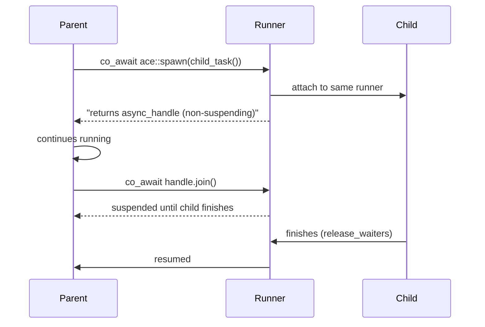
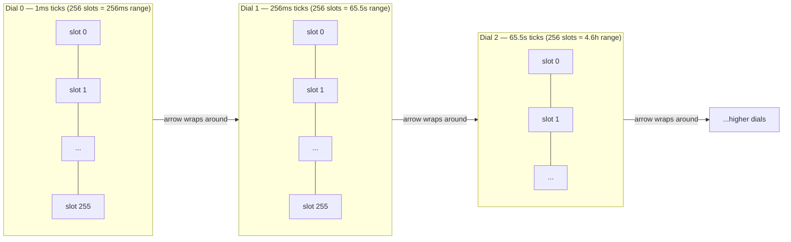
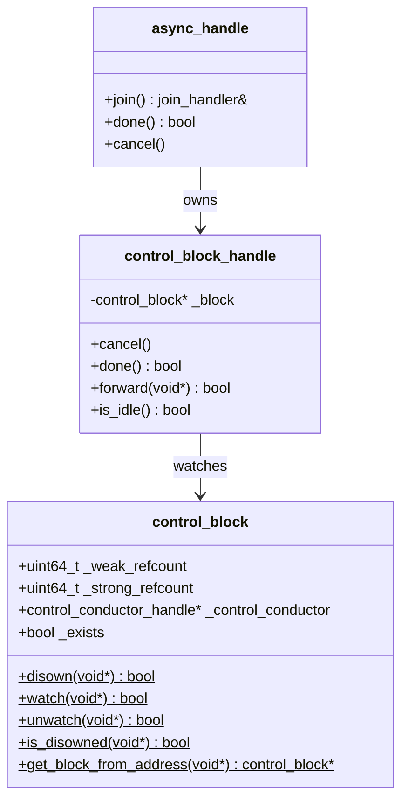

# ACE — Async Concurrent Execution

**ACE** is a header-only C++23 coroutine-based concurrency framework that provides a production-grade async runtime with multi-threaded scheduling, lock-free synchronization primitives, and high-performance I/O integration via `io_uring`.

> **Version:** 0.9.9 &nbsp;|&nbsp; **Language:** C++23

> **Warning:** Documentation is AI generated and still under human moderation

---

## Table of Contents

- [Features](#features)
- [Architecture Overview](#architecture-overview)
- [Core Concepts](#core-concepts)
  - [Coroutine Types](#1-coroutine-types-asynct-and-promiset)
  - [Execution Pipeline](#2-execution-pipeline)
  - [Conductor Pattern](#3-conductor-pattern)
  - [Futures and Synchronization](#4-futures-and-synchronization)
  - [Time Wheel Scheduler](#5-time-wheel-scheduler)
  - [Control Blocks](#6-control-blocks-and-external-handles)
  - [Async I/O](#7-async-io--filesystem-networking-console)
  - [Task Control](#8-task-control--roaming-reattach-polling)
- [Quickstart](#quickstart)
- [Examples](#examples)
- [Configuration](#configuration)
- [Building](#building)
- [API Reference](#api-reference)

---

## Features

| Feature                      | Details                                                     |
|------------------------------|-------------------------------------------------------------|
| **Header-only**              | Zero compilation overhead — just `#include "ace/ace.h"`     |
| **Lazy & eager coroutines**  | `ace::async<T>` (lazy) and `ace::promise<T>` (eager)        |
| **Multi-threaded scheduler** | Probability-weighted balancer with configurable runner count |
| **Lock-free channels**       | MPMC / MPSC message passing with static, dynamic, or hybrid allocation |
| **Cooperative mutex (cutex)** | Userspace mutex with zero kernel involvement on fast path  |
| **Time-wheel timeouts**      | O(1) insert/remove — hierarchical multi-dial wheel (up to ~4.6h range) |
| **Future composition**       | Logical AND/OR combinators + monadic pipe (`operator>>`)    |
| **Task control**             | External `async_handle` (join/cancel/done), roaming, reattach, polling |
| **Async I/O (io_uring)**     | File, socket, console I/O — read/write/send/recv/accept via Linux `io_uring` |
| **Background services**      | Vortex pattern — clock (timers), kernelic (io_uring polling) |

---

## Architecture Overview

### Files overview
| Directory           | Content description                                        |
|---------------------|------------------------------------------------------------|
| **core**            | Runtime engine: `runner`, `dispatcher`, `async`, `compose` |
| **core/tools**      | Utilities: `queue`, `macro`, `moving_average`, `id_alloc`  |
| **core/services**   | Vortex background services: `clock` (time wheel), `kernelic` (io_uring) |
| **core/traits**     | Traits to define framework-compatible units: `future`, `promise`, `conduction`, `vortex` |
| **futures**         | Synchronization & commands: `channel`, `cutex`, `timeout`, `spawn`, `post`, `reattach`, `roaming`, `polling`, `get_runner` |
| **ace/ (top-level)**| Public API: `ace.h`, I/O: `io.h`, FS: `fs.h`, Net: `net.h`, Console: `console.h` |



---

## Core Concepts

### 1. Coroutine Types: `async<T>` and `promise<T>`

ACE provides two coroutine flavors that differ only in their **initial suspension policy**.



```cpp
// Lazy — suspends immediately, must be explicitly scheduled
ace::async<int> lazy_task() {
    co_return 42;
}

// Eager — starts executing immediately upon creation
ace::promise<int> eager_task() {
    co_return 42;
}
```

**When to use which:**

| Type | Use when |
|---|---|
| `ace::async<T>` | Spawning independent parallel tasks, pipelines |
| `ace::promise<T>` | Short inline operations that must run immediately |

---

### 2. Execution Pipeline



The **balancer** distributes tasks across runners using an atomic counter for round-robin. Each **runner** owns a lock-free MPSC queue. Up to 128 tasks are processed per `run()` call; then the thread sleeps 1 ms if idle.

```cpp
// Configure runner count before first run()
ace::core::s_dispatcher_config._runners_amount = 4;
ace::reload();          // apply new config (only when queue is empty)

ace::schedule(my_task());
ace::run();             // blocks until all tasks finish
```

---

### 3. Conductor Pattern

The **conductor** is the mechanism that decouples task forwarding from the runner. When a coroutine suspends inside a `co_await future`, the future installs a conductor into the coroutine's promise. The runner then calls `conductor::forward()` instead of re-queuing the task.



**Two conductor types:**

| Type | Purpose |
|---|---|
| `runner_conductor_handle<C>` | Forwards task to a future's waiting queue |
| `control_conductor_handle` | Manages external control (join/cancel) for promises |

---

### 4. Futures and Synchronization

#### Channel — MPMC Message Passing



```cpp
ace::futures::channel<int> chan;

// producer
ace::schedule([&]() -> ace::task {
    chan << 42;         // non-blocking push
    co_return;
}());

// consumer
ace::schedule([&]() -> ace::task {
    int val = co_await chan.pull();
    // val == 42
    co_return;
}());
```

**Allocation variants:**

```cpp
// Default: fully dynamic (unlimited capacity)
ace::futures::channel<int> dyn_chan;

// Static: bounded buffer and bounded waiters (no heap allocation after init)
ace::futures::channel_static<int, 64, 8> static_chan;

// Dynamic data, static waiters
ace::futures::channel_dyn<int, 4> hybrid_chan;
```

---

#### Cutex — Cooperative Userspace Mutex

The **cutex** is a cooperative mutex with **zero kernel involvement** on the fast path. Lock/unlock are single atomic operations.

**Fast path (no contention)** — `try_lock()` does `fetch_add(1)` on `_users`. If the previous value was 0, the lock is yours. No suspension, no syscall.

**Slow path (contended)** — if `try_lock()` fails, the waiting task is moved into `_waiters` queue via the conductor. When the owner calls `sync()`, it does `fetch_sub(1)` and pops the next waiter, reattaching it to its runner.

**Deadlock recovery** — a rare race can strand a waiter: OS preempts task B between `try_lock()` fail and enqueue → task A calls `sync()` → queue empty → task B resumes, enqueues, stuck forever. `pending_notify()` detects this by retrying while `_users > 0`.

```
         try_lock()                           sync()
         fetch_add(1)                         fetch_sub(1)
             │                                     │
    ┌────────┴────────┐                   ┌────────┴────────┐
    │ result == 0     │                   │ users > 1       │
    │ → LOCKED ✓      │                   │ → notify()      │
    └─────────────────┘                   │ → wake waiter   │
    │ result > 0      │                   └─────────────────┘
    │ → await_suspend │                   │ users == 0      │
    │ → conductor     │                   │ → no waiters    │
    │ → _waiters.push │                   │ → pending check │
    └─────────────────┘                   └─────────────────┘
```

```cpp
ace::cutex mtx;

ace::task critical_section() {
    volatile auto guard = ace::guard(mtx);   // volatile prevents destructor elision
    auto lock = co_await guard->capture();   // acquire (may suspend if contended)
    // --- critical section ---
    co_await lock;                           // release
    guard->sync();
    co_return;
}
```

**Why `volatile`?** The compiler may optimise away the guard destructor if it thinks the variable is unused. `volatile` guarantees the RAII proxy runs `sync()` on scope exit.

**Rescheduling mode** — when `mtx.set_rescheduling(true)`, the releasing runner migrates the next waiter to its own pool. This pins the critical section to one CPU for better cache locality.

```cpp
mtx.set_rescheduling(true);   // all waiters will run on the releasing CPU
```

---

#### Timeout & Expire

```cpp
using namespace std::chrono_literals;

ace::task timed_task() {
    co_await ace::futures::timeout(500ms);     // suspend for 500 ms

    // OR: suspend until absolute timepoint
    auto deadline = ace::core::clock::current_time() + 1s;
    co_await ace::futures::expire(deadline);
    co_return;
}
```

---

#### spawn / async_handle — Parallel Tasks



```cpp
ace::task parent() {
    auto handle = co_await ace::spawn(child());

    // do other work concurrently...

    bool finished = co_await handle.join();  // wait for child
    // OR: handle.cancel();                  // cancel child
    co_return;
}
```

---

#### Future Composition — AND / OR / Pipe

ACE provides overloaded `operator and` and `operator or` for combining futures, plus a monadic pipe (`operator>>`).

```cpp
ace::task race_example() {
    auto t1 = co_await ace::spawn(compute(3));
    auto t2 = co_await ace::spawn(compute(7));

    // Race: await whichever finishes first
    auto result = co_await (t1.join() or t2.join());
    // result is a std::variant<bool, bool> (type depends on operands)

    co_return;
}

ace::task and_example() {
    // Await both, collect results as tuple
    auto [a, b] = co_await (
        ace::futures::timeout(10ms) and
        ace::futures::timeout(20ms)
    );
    co_return;
}

ace::task pipe_example() {
    // Monadic pipe: result of left flows into right
    co_await (compute(5) >> another_task);
    co_return;
}
```

---

### 5. Time Wheel Scheduler

ACE uses a **hierarchical multi-dial time wheel** for O(1) timer insert and release. Each wheel level has 256 slots; finer wheels cascade into coarser ones.



The clock runs as a **vortex** — a thread-local background coroutine that calls `ping()` each scheduler iteration to release expired tasks back to their runners.

---

### 6. Control Blocks and External Handles

Every coroutine's promise is allocated with a `control_block` prefix (intrusive design — no extra heap allocation).



Memory layout of a coroutine frame:

```
┌────────────────────────────────────┬──────────────────────┬─────────────────────┐
│  control_block  (32 bytes)         │  promise_type        │  coroutine frame    │
│  _weak_refcount                    │  _runner_conductor   │  local variables    │
│  _strong_refcount                  │  _runner_pool        │  ...                │
│  _control_conductor                │  _waiters            │                     │
│  _exists                           │  _status             │                     │
└────────────────────────────────────┴──────────────────────┴─────────────────────┘
 ▲                                    ▲
 get_block_from_address(addr)         address returned by operator new
```

---

### 7. Async I/O — Filesystem, Networking, Console

ACE provides a layered async I/O stack built on top of `io_uring`:

| Layer | Header | Key types |
|---|---|---|
| Raw io_uring | `ace/core/services/kernelic.h` | `kernel_controller`, `kernel_observer` |
| I/O abstractions | `ace/core/io.h` | `io_entity<T>`, `io_link`, `io_query<T>` |
| Filesystem | `ace/fs.h` | `ace::fs::file`, `ace::fs::file_link` |
| Networking | `ace/net.h` | `io_socket`, `io_listener`, `io_connection` |
| Console | `ace/console.h` | `ace::console` |

#### Filesystem

```cpp
#include "ace/fs.h"

ace::task read_file() {
    ace::fs::file f{"/tmp/data.txt"};

    // Open asynchronously — consumes the file, returns a file_link
    auto link = co_await f.open_rdonly();

    // Read entire file as string
    auto data = co_await link.read_str();
    if (data) {
        std::cout << *data << std::endl;
    }
    co_return;
}
```

#### Networking (TCP echo server)

```cpp
#include "ace/net.h"

ace::task echo_server() {
    // Create TCP socket → bind → listen
    auto listener = co_await (
        ace::net::io_socket_tcp{} >>
        [](auto sock) -> ace::task {
            co_return co_await sock.bind("0.0.0.0", 8080);
        }
    );

    while (true) {
        // Accept incoming connection
        auto conn = co_await listener.accept();

        // Convert to io_connection_link for read/write
        auto link = ace::net::io_connection_link::consume(conn);

        // Spawn handler for this connection
        co_await ace::spawn([link = std::move(link)]() -> ace::task {
            auto data = co_await link.read_str();
            if (data) link.writeln(*data);
            co_return;
        }());
    }
    co_return;
}
```

#### Console

```cpp
#include "ace/console.h"

ace::task interactive() {
    while (true) {
        ace::console::print("> ");
        auto input = co_await ace::console::input();
        if (not input) break;
        ace::console::println("echo: {}", *input);
    }
    co_return;
}
```

---

### 8. Task Control — Roaming, Reattach, Polling

ACE provides awaitable commands that control how a coroutine interacts with the scheduler at runtime — without suspending the coroutine.

#### Roaming — control cross-runner migration

```cpp
ace::task pinned_task() {
    co_await ace::futures::roaming{false};  // pin to current runner
    // ... CPU-local work ...
    co_await ace::futures::roaming{true};   // allow migration again
    co_return;
}
```

#### Reattach — migrate to another runner

```cpp
ace::task migrate() {
    auto* target_runner = co_await ace::futures::get_runner{};
    // do work on current runner...
    co_await ace::futures::reattach{target_runner};
    // now executing on target_runner
    co_return;
}
```

#### Polling — mark as low-priority background task

```cpp
ace::task background_worker() {
    co_await ace::futures::polling{true};  // moved to vortex_pool
    while (not done) {
        do_background_work();
        co_await ace::suspend();
    }
    co_return;
}
```

---

## Quickstart

### 1. Add to your project

ACE is header-only. Add the `include/` directory to your include paths and ensure `liburing` is available on Linux.

**With Meson:**

```meson
ace_dep = dependency('ace', fallback: ['ace', 'ace_dep'])
```

**Manual (CMake/plain):**

```cmake
target_include_directories(my_target PRIVATE path/to/ace/include)
target_link_libraries(my_target PRIVATE uring)
```

### 2. Hello, coroutine

```cpp
#include "ace/ace.h"
#include <iostream>

ace::task hello() {
    std::cout << "Hello from coroutine!\n";
    co_return;
}

int main() {
    ace::schedule(hello());
    ace::run();
}
```

### 3. Parallel tasks with join

```cpp
#include "ace/ace.h"
#include <iostream>
#include <chrono>

using namespace std::chrono_literals;

ace::async<int> compute(int x) {
    co_await ace::futures::timeout(10ms);   // simulate async work
    co_return x * x;
}

ace::task main_task() {
    // spawn two tasks in parallel
    auto h1 = co_await ace::spawn(compute(3));
    auto h2 = co_await ace::spawn(compute(7));

    co_await h1.join();
    co_await h2.join();

    std::cout << "both tasks done\n";
    co_return;
}

int main() {
    ace::schedule(main_task());
    ace::run();
}
```

### 4. Multi-threaded execution

```cpp
int main() {
    // use 4 OS threads
    ace::core::s_dispatcher_config._runners_amount = 4;
    ace::reload();

    for (int i = 0; i < 100; ++i)
        ace::schedule(my_task(i));

    ace::run();
}
```

---

## Examples

### Producer / Consumer with bounded channel

```cpp
#include "ace/ace.h"

// Static channel: 8 data slots, 4 waiter slots — no heap allocation
ace::futures::channel_static<int, 8, 4> chan;

ace::task producer() {
    for (int i = 0; i < 20; ++i) {
        // pending_push waits (via co_await suspend) if channel is full
        co_await chan.pending_push(i);
    }
    co_return;
}

ace::task consumer() {
    for (int i = 0; i < 20; ++i) {
        int val = co_await chan.pull();
        (void)val;
    }
    co_return;
}

int main() {
    ace::schedule(producer());
    ace::schedule(consumer());
    ace::run();
}
```

---

### Shared state with cutex

```cpp
#include "ace/ace.h"

ace::cutex mtx;
int shared_counter = 0;

ace::task increment(int times) {
    for (int i = 0; i < times; ++i) {
        volatile auto guard = ace::guard(mtx);
        auto future = co_await guard->capture();
        ++shared_counter;
        co_await future;
        guard->sync();
    }
    co_return;
}

int main() {
    ace::core::s_dispatcher_config._runners_amount = 4;
    ace::reload();

    for (int t = 0; t < 8; ++t)
        ace::schedule(increment(10000));

    ace::run();
    // shared_counter == 80000
}
```

---

### Timeout and cancellation

```cpp
#include "ace/ace.h"
#include <chrono>

using namespace std::chrono_literals;

ace::task long_operation() {
    co_await ace::futures::timeout(10s);
    co_return;
}

ace::task watchdog() {
    auto handle = co_await ace::spawn(long_operation());
    co_await ace::futures::timeout(500ms);   // wait at most 500ms
    if (!handle.done()) {
        handle.cancel();
    }
    co_return;
}

int main() {
    ace::schedule(watchdog());
    ace::run();
}
```

---

### External task observation

```cpp
ace::task work() {
    co_await ace::futures::timeout(std::chrono::milliseconds(100));
    co_return;
}

int main() {
    auto task = work();
    auto handle = task.observe();   // obtain control_block_handle before scheduling

    ace::schedule(std::move(task));

    // check from outside the scheduler:
    // handle.done()   — true if coroutine has finished
    // handle.cancel() — request cancellation

    ace::run();
}
```

---

## Configuration

### Runner count

```cpp
ace::core::s_dispatcher_config._runners_amount = std::thread::hardware_concurrency();
ace::reload();   // must be called when the queue is empty
```

### Task distribution mode

When `_runners_amount > 1`, the dispatcher uses probability-weighted selection based on per-runner velocity (tasks/sec).  Runners with lower velocity are more likely to receive new tasks.

### Cutex rescheduling mode

When `_rescheduling = true`, the cutex migrates all waiters to the runner that last released it. Useful for CPU-local hot paths.

```cpp
ace::cutex mtx;
mtx.set_rescheduling(true);
```

### Channel allocation policy

```cpp
// Fully dynamic (default) — heap allocates on demand
ace::futures::channel<MyMsg> ch;

// Static — no heap, all sizes fixed at compile time
ace::futures::channel_static<MyMsg, 256, 16> ch;

// Dynamic data queue, static-sized waiter queue
ace::futures::channel_dyn<MyMsg, 4> ch;
```

---

## Building

### Requirements

| Dependency | Version | Notes |
|---|---|---|
| C++ compiler | GCC 13+ / Clang 17+ | C++23 required |
| `liburing` | 2.x | Linux only (for I/O) |
| `nukes` | subproject | Lock-free MPSC/MPMC queues |
| `meson` | 1.0+ | Build system |
| `gtest` | any | Tests only |
| `mimalloc` | 2.x | Tests only |

### Build

```bash
meson setup build
meson compile -C build
```

### Run tests

```bash
meson test -C build --verbose
```

### Generate documentation

```bash
# Requires: doxygen, graphviz (dot)
doxygen Doxyfile
# Open: docs/doxygen/html/index.html
```

---

## API Reference

Full Doxygen-generated API reference is available after running `doxygen Doxyfile`.
Open `docs/doxygen/html/index.html` in a browser.

### Namespace map

| Namespace | Key types / functions |
|---|---|
| `ace` | `async<T>` `promise<T>` `task` `cutex` `guard`<br>`schedule()` `spawn()` `post()` `run()` `reload()` `interrupt()` `terminate()` `empty()` `reset_signal()` |
| `ace::core` | `async<T,R>` `dispatcher` `runner` `control_block` `control_block_handle`<br>`cast_ptr` `io_entity` `io_link` `io_query` `io_guard` `any` |
| `ace::core::traits` | `future_traits` `busy_future_traits` `promise_traits` `promise_return_traits`<br>`runner_conductor_handle` `control_conductor_handle` `conductor_slot` `vortex_traits` |
| `ace::core::services` | `clock` (multi_dial time wheel) `kernel_controller` (io_uring vortex) |
| `ace::core::tools` | `queue` `q_node` `slab_mempool` `moving_average` `id_allocator` `lifetime` |
| `ace::core::meta` | `is_future` `is_busy_future` `is_awaitable` `resume_type` `replace_type`<br>`unique_tuple_t` `tuple_to_variant_t` |
| `ace::futures` | `channel` `channel_static` `cutex` `cutex_future` `timeout` `expire` `spawn` `post`<br>`async_handle` `join_handler` `reattach` `roaming` `polling` `get_runner` |
| `ace::fs` | `file` (io_entity) `file_link` (io_link) |
| `ace::net` | `io_socket` `io_mapping_entity` `io_stream_mode_entity`<br>`io_listener_entity` `io_transport_entity` `io_connection_link` |
| `ace::console` | `console` — async stdin/stdout I/O |

### Key free functions (`namespace ace`)

```cpp
// --- Task lifecycle ---

// Schedule task on the global dispatcher (marks task as roaming)
void schedule(task&& task, const core::runner* rnr = nullptr);

// Spawn a parallel task pinned to the current runner (must be co_awaited)
futures::spawn spawn(task&& task);

// Post a parallel task to the front of the current runner's queue
futures::post post(task&& task);

// Migrate the calling coroutine to a different runner
futures::reattach reattach(core::runner* target);

// Enable/disable cross-runner migration for the current task
futures::roaming roaming(bool is_roaming = true);

// Mark/unmark the current task as a low-priority polling task
futures::polling polling(bool is_polling = true);

// Retrieve a pointer to the current runner
futures::get_runner get_runner();

// --- Runtime control ---

// Returns true when all runners are empty
bool empty();

// Process all scheduled tasks — blocks until the queue is empty
void run();

// Reload dispatcher configuration (only effective when empty() == true)
bool reload();

// Send signals to the running dispatcher
void interrupt();    // pause execution loop (vortex services)
void terminate();    // stop execution loop
void reset_signal(); // clear pending signals
```
