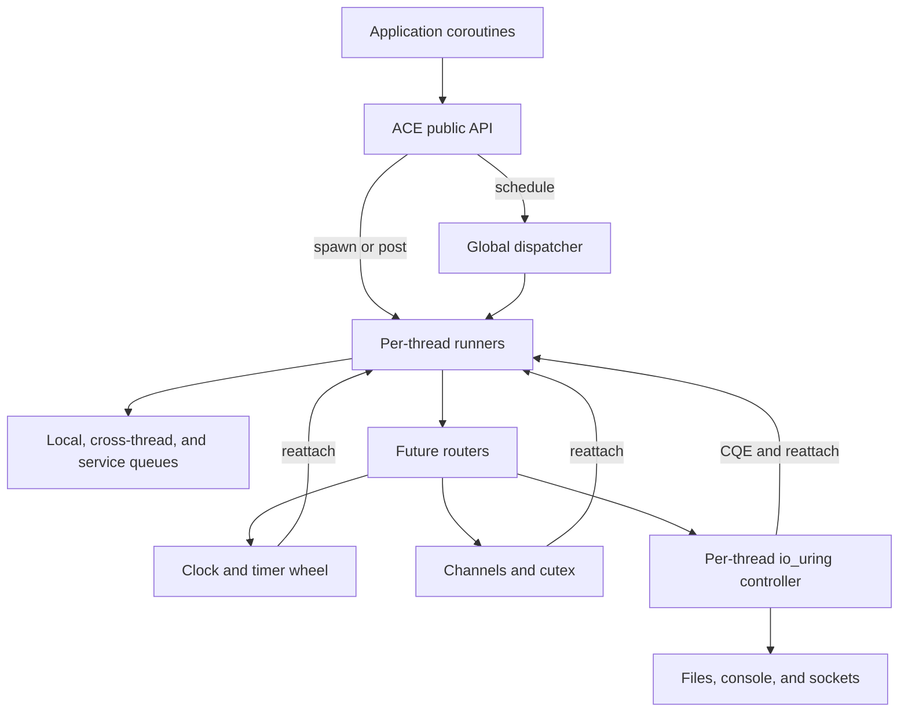
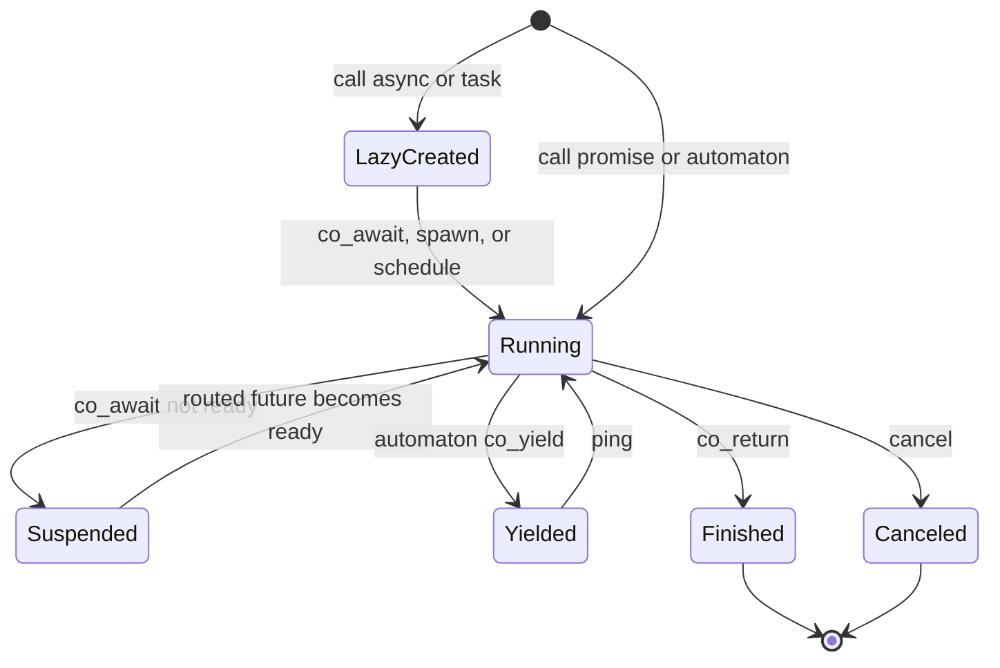
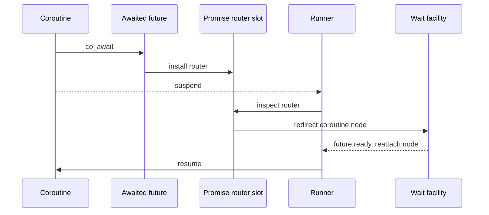
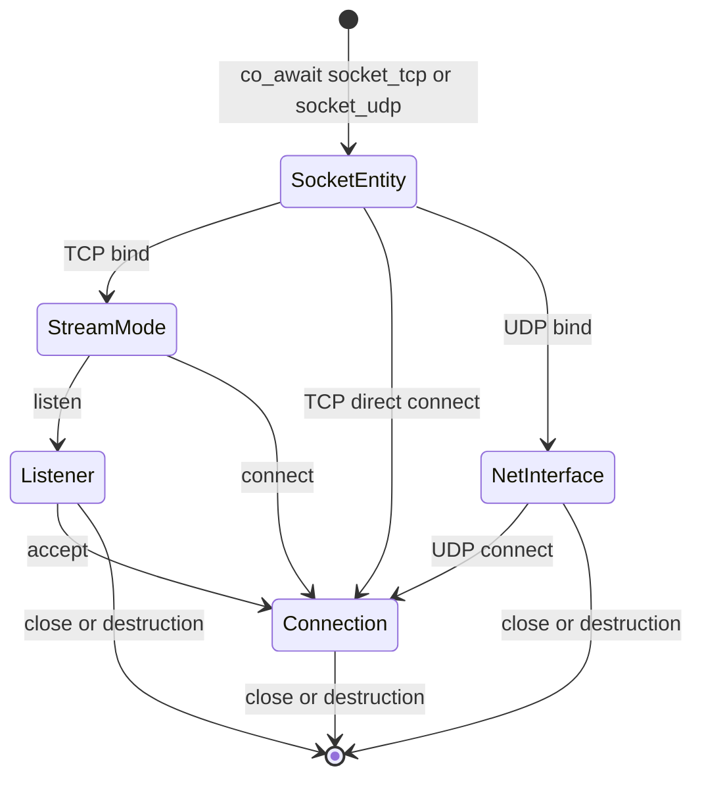

# ACE - Async Concurrent Execution

ACE is an experimental, pre-1.0 C++23 coroutine framework for Linux. It provides
a scheduler, coroutine types, task control, synchronization, timers, and
`io_uring`-based I/O.

> [!WARNING]
> ACE is not production-grade. Its API and behavior may change before 1.0, and
> known correctness and portability issues remain. Use it for experiments,
> learning, and framework development rather than critical applications.

Current project version: `0.9.9`.

## What ACE Provides

- Lazy, eager, and yielding coroutine types.
- A configurable multi-runner dispatcher.
- Spawn, join, cancellation, task migration, and future composition.
- Channels, a cooperative mutex (`cutex`), and a hierarchical timer wheel.
- Linux file, console, TCP, UDP, and raw-socket I/O through `io_uring`.
- A header-only public runtime API, with Meson integration for dependencies,
  tests, benchmarks, and the optional entry-point library.


```mermaid
flowchart TB
    App[Application coroutines] --> API[ACE public API]
    API -->|schedule| Dispatcher[Global dispatcher]
    API -->|spawn or post| Runner
    Dispatcher --> Runner[Per-thread runners]
    Runner --> Queues[Local, cross-thread, and service queues]
    Runner --> Router[Future routers]
    Router --> Timers[Clock and timer wheel]
    Router --> Sync[Channels and cutex]
    Router --> Kernel[Per-thread io_uring controller]
    Kernel --> IO[Files, console, and sockets]
    Timers -->|reattach| Runner
    Sync -->|reattach| Runner
    Kernel -->|CQE and reattach| Runner
```

The dispatcher owns one runner per configured thread. Runner 0 executes on the
thread that calls `ace::run()`; additional runners use worker threads. Suspended
coroutines are routed to a timer, synchronization primitive, another runner, or
an I/O service and are reattached when they can continue.

## Requirements

- Linux with `io_uring` support.
- A C++23 compiler.
- Meson and Ninja. CMake is also used by Meson to consume the Nukes subproject.
- `liburing` and the Nukes queue library. Meson wrap files are included.
- GoogleTest and mimalloc for tests only.
- Google Benchmark for benchmarks only.
- Doxygen and Graphviz for generated API documentation.

ACE's runtime interface is header-only, but that does not mean dependency-free.
Programs still need the ACE and Nukes include paths and must link `liburing`.
Meson's `ace_dep` supplies those requirements. Enabling `ace_entry` also builds a
small static library that provides the optional weak `main()` entry point.

## Include Order

Start with `ace/ace.h`, then include extension headers:

```cpp
#include <ace/ace.h>
#include <ace/console.h>
#include <ace/futures/channel.h>
#include <ace/futures/cutex.h>
#include <ace/futures/polling.h>
#include <ace/futures/timeout.h>
#include <ace/net.h>
```

This order matters. Short names such as `ace::timeout`, `ace::channel`,
`ace::cutex`, `ace::polling`, `ace::println`, and `ace::input` are exported by
extension headers only when `ace/ace.h` has already defined `ACE_H`. Without that
order, use full names such as `ace::futures::timeout` and
`ace::console::println`.

The examples below use the preferred short names.

## Quick Start

```cpp
#include <ace/ace.h>
#include <ace/console.h>
#include <ace/futures/timeout.h>

#include <chrono>

using namespace std::chrono_literals;

ace::task hello() {
    co_await ace::timeout(10ms);
    ace::println("Hello from ACE");
    co_return;
}

int main() {
    ace::schedule(hello());
    ace::run();
}
```

`ace::run()` blocks while the dispatcher processes scheduled work. The default
runner count is one. Configure more runners before scheduling work:

```cpp
int main() {
    ace::cfg::g_config._runners_amount = 4;
    if (not ace::reload())
        return 1;

    ace::schedule(hello());
    ace::run();
}
```

## Coroutine Types

| Type | Start policy | Purpose |
|---|---|---|
| `ace::async<T>` | Lazy | Returns `T`; starts when awaited or attached to a runner. |
| `ace::promise<T>` | Eager | Starts when the coroutine function is called. |
| `ace::automaton<T>` | Eager | Produces values with `co_yield` and a final value with `co_return`. |
| `ace::task` | Lazy | Alias for `ace::async<void>` and the type accepted by `ace::schedule()`. |


```mermaid
stateDiagram-v2
    [*] --> LazyCreated: call async or task
    LazyCreated --> Running: co_await, spawn, or schedule
    [*] --> Running: call promise or automaton
    Running --> Suspended: co_await not ready
    Suspended --> Running: routed future becomes ready
    Running --> Yielded: automaton co_yield
    Yielded --> Running: ping
    Running --> Finished: co_return
    Running --> Canceled: cancel
    Finished --> [*]
    Canceled --> [*]
```

Every `ace::async<T>` is move-only. Moving it transfers ownership of its
coroutine handle; copying is not supported. This also applies to `ace::task`.

```cpp
ace::async<int> answer() {
    co_return 42;
}

ace::task await_answer() {
    auto operation = answer();
    auto value = co_await std::move(operation);
    ace::println("answer: {}", value);
    co_return;
}
```

### Scheduling Typed Coroutines

`ace::schedule()` accepts `ace::task`, not `ace::async<T>`. Await a typed
coroutine from another coroutine, spawn it, or explicitly discard its result
through `ace::task_wrap()`:

```cpp
int main() {
    auto operation = answer();
    ace::schedule(ace::task_wrap(std::move(operation)));
    ace::run();
}
```

### Spawn, Join, and Cancel

`co_await ace::spawn(child())` attaches the child to the current runner and
returns immediately with a move-only `async_handle`. A regular task's `join()`
waits for completion and returns `bool` for `void` or `std::optional<T>` for a
typed task. `cancel()` requests cancellation, and `done()` checks for a terminal
state.

```cpp
ace::async<int> calculate(int input) {
    co_return input * input;
}

ace::task parent() {
    auto handle = co_await ace::spawn(calculate(7));
    auto result = co_await handle.join();
    if (result)
        ace::println("result: {}", *result);
    co_return;
}
```

### Automatons

Automatons have different handle semantics:

- `ping()` consumes one pending `co_yield` value. After the automaton finishes,
  it can return the final `co_return` value.
- `join()` performs one ping-like read. If the automaton is still active, it
  then requests cancellation; it does not drain every yield.
- `cancel()` explicitly stops the automaton.
- Destroying a live automaton handle automatically cancels the automaton.

```cpp
ace::automaton<int> numbers() {
    co_yield 1;
    co_yield 2;
    co_return 3;
}

ace::task consume_numbers() {
    auto handle = co_await ace::spawn(numbers());
    auto first = co_await handle.ping();
    auto next_and_stop = co_await handle.join();
    co_return;
}
```

## Suspension and Routing

ACE futures install a router in the waiting coroutine. The runner forwards the
coroutine node to that router instead of repeatedly polling the coroutine.


```mermaid
sequenceDiagram
    participant C as Coroutine
    participant F as Awaited future
    participant P as Promise router slot
    participant R as Runner
    participant W as Wait facility
    C->>F: co_await
    F->>P: install router
    C-->>R: suspend
    R->>P: inspect router
    P->>W: redirect coroutine node
    W-->>R: future ready, reattach node
    R->>C: resume
```

Timer futures route to the clock's hierarchical time wheel. I/O queries route to
the current thread's `io_uring` controller. Channels and `cutex` maintain waiter
queues. `ace::reattach()` can move a suspended coroutine to another runner.

ACE also overloads logical composition for futures:

- `a or b` resumes when one operation wins.
- `a and b` waits for both operations.
- `sender >> responder` passes a result into another operation.

Do not use `&&` or `||` with non-`bool` ACE-related values. Those operators are
also composition syntax and can select an unintended overload.

## Networking

Socket APIs form move-consuming state machines. Awaiting `bind()`, `connect()`,
or `listen()` transfers the file descriptor into the next entity. Do not use the
previous entity after the transition. Socket entities are movable, not copyable;
store them as movable members or in `std::optional` when needed.


```mermaid
stateDiagram-v2
    [*] --> SocketEntity: co_await socket_tcp or socket_udp
    SocketEntity --> StreamMode: TCP bind
    SocketEntity --> Connection: TCP direct connect
    StreamMode --> Listener: listen
    StreamMode --> Connection: connect
    Listener --> Connection: accept
    SocketEntity --> NetInterface: UDP bind
    NetInterface --> Connection: UDP connect
    Connection --> [*]: close or destruction
    NetInterface --> [*]: close or destruction
    Listener --> [*]: close or destruction
```

`connection::recv_buf()` is special: it returns an eager
`ace::promise<ace::io::input_t>`, so receiving starts immediately when the method
is called. You must still `co_await` that promise to obtain the result and keep
its owning object alive.

```cpp
#include <ace/ace.h>
#include <ace/console.h>
#include <ace/net.h>

#include <cstdint>
#include <string>
#include <string_view>

ace::task tcp_client(std::string_view host, std::uint16_t port) {
    auto socket = co_await ace::net::socket_tcp{};
    if (not socket)
        co_return;

    auto stream = co_await socket.bind("0.0.0.0", 0);
    if (not stream)
        co_return;

    auto connection = co_await stream.connect(host, port);
    if (not connection)
        co_return;

    if (co_await connection.send("hello") < 0)
        co_return;

    auto input = co_await connection.recv_buf();
    if (input)
        ace::println("reply: {}", input.value().as<std::string>());
    co_return;
}
```

## Important Safety Rules

### Coroutine Lambda Lifetime

Coroutine lambdas are supported. For a capturing coroutine lambda, keep the
lambda closure alive until the returned coroutine has completed or been
cancelled. The coroutine may retain a pointer to its closure, so immediately
invoking a temporary capturing lambda and storing its returned `async` can leave
the coroutine with dangling captures. Named coroutine functions remain the
simplest choice when closure lifetime would otherwise be difficult to see.

### Ownership and Lifetime

- Treat every `ace::async<T>` and `async_handle` as move-only.
- Move a typed async when ownership is transferred to `task_wrap()` or another
  owner.
- Do not access a network entity after a consuming transition.
- Await eager operations such as `recv_buf()` even though they start before the
  await.
- Cancellation is part of coroutine and router lifetime management; do not let
  references used by an operation expire while it is suspended.
- Keep a capturing coroutine lambda's closure alive for the entire lifetime of
  the coroutine returned by that closure.

## Build and Use

Configure the project and resolve its runtime dependencies:

```bash
meson setup build
meson compile -C build
```

When ACE is a Meson subproject, consume its declared dependency:

```meson
ace_dep = dependency('ace', fallback: ['ace', 'ace_dep'])

executable(
  'my_app',
  'main.cpp',
  dependencies: ace_dep,
)
```

The default build expects the application to provide `main()`. To build ACE's
optional weak entry point for a `co_main()` application, configure with
`-Dace_entry=true`.

## Tests

```bash
meson setup build-test -Dtests=true
meson compile -C build-test ace_tests
meson test -C build-test --print-errorlogs
```

For an existing build directory, use
`meson setup build-test --reconfigure -Dtests=true` before compiling. Meson
registers each GoogleTest case as a separate test process.

## Benchmarks

```bash
meson setup build-bench -Dbenchmarks=true
meson compile -C build-bench ace_benchmarks
./build-bench/ace_benchmarks
```

The benchmark target is compiled as a release target (`-O3` with `NDEBUG`), so
`is_debug` is `false` in benchmark code.

For an existing build directory, use
`meson setup build-bench --reconfigure -Dbenchmarks=true`. Benchmark results are
not correctness tests and should be compared across repeated runs in the same
environment.

## API Documentation

The Doxygen target is generated directly from the project configuration; it is
not a Meson build target:

```bash
doxygen Doxyfile
```

Open `docs/doxygen/html/index.html`. The Doxygen input includes this README and
all public headers under `include/`.

## Project Status

ACE currently targets Linux and GCC/Clang-style toolchains. The project is below
version 1.0, has open bugs and technical debt, and may make breaking API changes.
See `agents/ISSUES.md` for the internal issue register and the generated Doxygen
pages for detailed API contracts.
